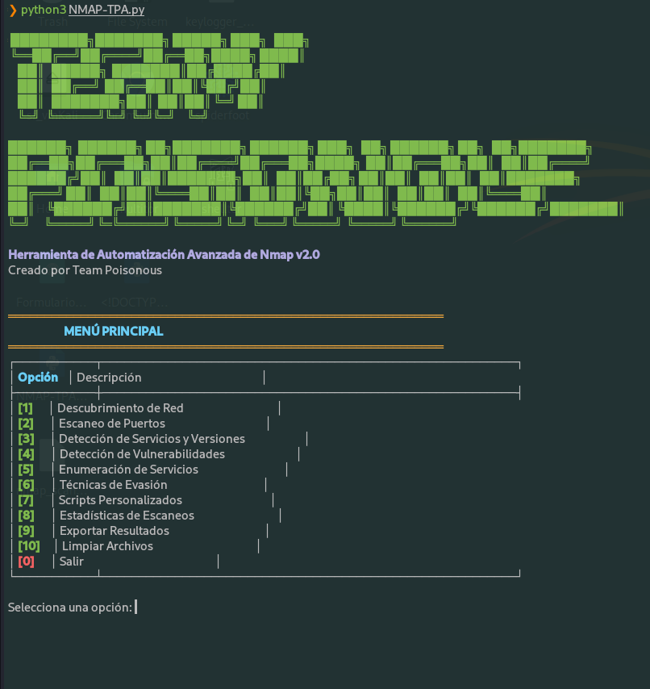
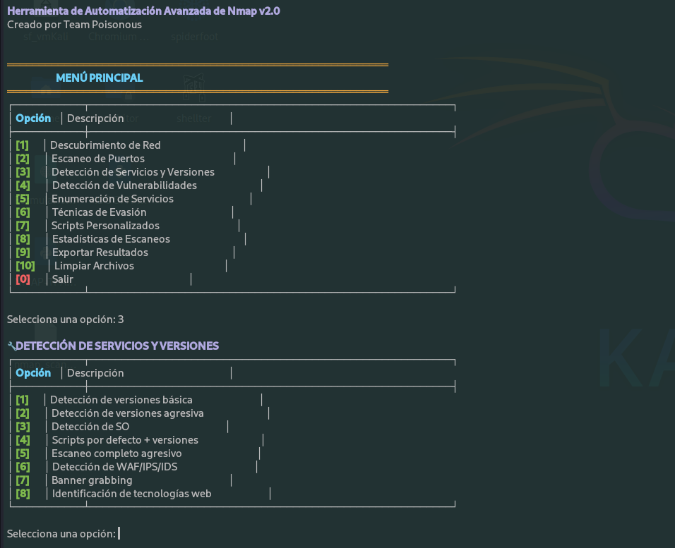

# Team Poisonous Nmap Automation v2.0  

--------------------------------------------------------
══════════════════════════════════════════════

 ████████╗███████╗ █████╗ ███╗   ███╗
 ╚══██╔══╝██╔════╝██╔══██╗████╗ ████║
    ██║   █████╗  ███████║██╔████╔██║
    ██║   ██╔══╝  ██╔══██║██║╚██╔╝██║
    ██║   ███████╗██║  ██║██║ ╚═╝ ██║
    ╚═╝   ╚══════╝╚═╝  ╚═╝╚═╝     ╚═╝
                                      
██████╗  ██████╗ ██╗███████╗ ██████╗ ███╗   ██╗ ██████╗ ██╗   ██╗███████╗
██╔══██╗██╔═══██╗██║██╔════╝██╔═══██╗████╗  ██║██╔═══██╗██║   ██║██╔════╝
██████╔╝██║   ██║██║███████╗██║   ██║██╔██╗ ██║██║   ██║██║   ██║███████╗
██╔═══╝ ██║   ██║██║╚════██║██║   ██║██║╚██╗██║██║   ██║██║   ██║╚════██║
██║     ╚██████╔╝██║███████║╚██████╔╝██║ ╚████║╚██████╔╝╚██████╔╝███████║
╚═╝      ╚═════╝ ╚═╚══════╝ ╚═════╝ ╚═╝  ╚═══╝ ╚═════╝  ╚═════╝ ╚══════╝


**Creado por Mario**.


---

### 👤 Creado por Mario

---

## 🌟 ¿Por Qué Elegir Nuestra Herramienta?

Team Poisonous Nmap Automation revoluciona la forma de realizar auditorías de red al combinar el poder de Nmap con una interfaz intuitiva.

✅ 12 categorías de escaneo en menús interactivos  
✅ Automatización inteligente de técnicas avanzadas  
✅ Gestión profesional de resultados y reportes  
✅ Detección de vulnerabilidades con un solo clic  
✅ Técnicas de evasión para pruebas de penetración reales  

> *"La herramienta más completa que he usado para automatizar Nmap - ahorra horas de trabajo"*  
> – Hacker Ético Certificado

---

## 🔥 Características Destacadas

| Categoría      | Funcionalidades Clave                                                                 |
|----------------|----------------------------------------------------------------------------------------|
| 🌐 Descubrimiento | Ping Sweep, ARP Scan, TCP SYN Discovery, Traceroute                                   |
| 🔍 Escaneo        | 12 técnicas incluyendo Stealth, XMAS, NULL y UDP Scans                                |
| 🛡️ Vulnerabilidades | Detección SMB, SSH, HTTP, SSL y escaneo completo con XML                            |
| 📋 Enumeración    | SMB, SNMP, DNS, HTTP, FTP, SSH, Bases de Datos                                       |
| 🥷 Evasión         | Fragmentación, IP Spoofing, Señuelos, Proxy/Tor                                      |
| 📊 Reportes       | Estadísticas, Exportación Consolidada, Limpieza Inteligente                         |

---

## 🚀 Instalación en 30 Segundos

Asegúrate de tener **Python 3** y **Nmap** instalado.

```bash
# Instalar Nmap (Debian/Ubuntu)
sudo apt-get install nmap

# Clonar el repositorio
git clone https://github.com/Whoam4/TPA-Nmap-Script.git

# Entrar en el directorio
cd TPA-Nmap-Script

# Ejecutar la herramienta
python3 TPA-Nmap.py
```

### 🧭 Menú Principal Interactivo
══════════════════════════════════════

| Opción | Descripción                          |
|--------|--------------------------------------|
| [1]    | 🌐 Descubrimiento de Red             |
| [2]    | 🔍 Escaneo de Puertos                |
| [3]    | 🔧 Detección de Servicios            |
| [4]    | 🛡️ Detección de Vulnerabilidades     |
| [5]    | 📋 Enumeración de Servicios          |
| [6]    | 🥷 Técnicas de Evasión               |
| [7]    | ⚡ Scripts Personalizados            |
| [8]    | 📊 Estadísticas                      |
| [9]    | 📤 Exportar Resultados               |
| [10]   | 🧹 Limpiar Archivos                  |
| [0]    | 🚪 Salir                             |

### 🗂️ Catálogo completo de operaciones
```bash
# DESCUBRIMIENTO DE RED
[1] Ping Sweep            → nmap -sn
[2] ARP Scan              → nmap -PR
[3] TCP SYN Discovery     → nmap -PS
[4] UDP Discovery         → nmap -PU
[5] Full Discovery        → nmap -sn -PE -PP -PM -PO
[6] Traceroute            → nmap --traceroute

# ESCANEO DE PUERTOS
[1] TCP SYN (Stealth)     → nmap -sS
[2] TCP Connect           → nmap -sT
[3] UDP Scan              → nmap -sU --top-ports 1000
[4] TCP ACK (Firewalls)   → nmap -sA
[5] Window Scan           → nmap -sW
[6] Maimon Scan           → nmap -sM
[7] FIN Scan              → nmap -sF
[8] NULL Scan             → nmap -sN
[9] XMAS Scan             → nmap -sX
[10] Top 1000 puertos     → nmap --top-ports 1000
[11] Todos los puertos    → nmap -p-
[12] Puertos personalizados → nmap -p [PUERTOS]

# DETECCIÓN DE SERVICIOS
[1] Versiones básicas     → nmap -sV
[2] Versiones agresivas   → nmap -sV --version-intensity 9
[3] Detección de SO       → nmap -O
[4] Scripts default       → nmap -sC -sV
[5] Escaneo agresivo      → nmap -A
[6] WAF/IPS/IDS           → nmap --script http-waf-detect,http-waf-fingerprint
[7] Banner grabbing       → nmap --script banner
[8] Tech web              → nmap --script http-enum,http-headers,http-methods

# VULNERABILIDADES
[1] General               → nmap --script vuln
[2] SMB                   → nmap --script smb-vuln*
[3] SSH                   → nmap --script ssh-*
[4] HTTP                  → nmap --script http-vuln*
[5] FTP                   → nmap --script ftp-*
[6] SSL/TLS               → nmap --script ssl-*
[7] Malware               → nmap --script malware
[8] XML completo          → nmap -sV --script=vuln -oX

# ENUMERACIÓN
[1] SMB completa          → nmap --script smb-enum-*,smb-ls,smb-os-discovery
[2] SNMP                  → nmap -sU --script snmp-*
[3] DNS                   → nmap --script dns-*
[4] HTTP/HTTPS            → nmap --script http-*enum*,http-methods
[5] FTP                   → nmap --script ftp-*enum*,ftp-anon
[6] SSH                   → nmap --script ssh-*enum*,ssh-auth-methods
[7] Bases de datos        → nmap --script mysql-*,ms-sql-*,oracle-*
[8] LDAP                  → nmap --script ldap-*

# EVASIÓN
[1] Fragmentación         → nmap -f
[2] Señuelos              → nmap -D [IPs]
[3] IP Spoofing           → nmap -S [IP_FALSA]
[4] Randomizar hosts      → nmap --randomize-hosts
[5] Timing lento (T0)     → nmap -T0
[6] Cambiar MTU           → nmap --mtu [VALOR]
[7] Proxy/Tor             → nmap --proxies [PROXY]

# SCRIPTS PERSONALIZADOS
[1] Script específico     → nmap --script [NOMBRE]
[2] Listar scripts        → nmap --script-help all
[3] Por categoría         → nmap --script [CATEGORÍA]
[4] Combo Discovery       → nmap -sS -sV -sC --script discovery,enumeration,vuln -A
[5] Escaneo completo      → nmap -sS -sV -sC -A -p- --script vuln,enum,discovery -oA
```
---

---


### 🕵️‍♂️ Demostración Práctica
══════════════════════════════════════

*Menú interactivo con opciones de escaneo y vulnerabilidades.*


*Ejemplo de algunas opciones de escaneo de Nmap ejecutado por la herramienta.*


---

### 📊 Gestión Profesional de Resultados
🧠 Registro automático
Cada comando ejecutado queda registrado en nmap_scans.log, lo que permite revisar tu historial completo y auditar tu trabajo sin perder detalle.

🗂️ Archivos timestamp inteligentes
Los resultados se guardan con nombre automático y fecha, como:
vuln_scan_20240725_1423.txt
Ideal para identificar rápidamente qué se hizo y cuándo.

📤 Exportación consolidada
Con un solo clic puedes generar informes completos listos para entregar o documentar auditorías.

📈 Estadísticas avanzadas al instante
La herramienta calcula métricas de rendimiento para que midas tu eficiencia en tiempo real.


### 📊 ESTADÍSTICAS DE ESCANEOS

• 🧪 Comandos ejecutados:      24
• ❌ Errores detectados:        2
• 📁 Archivos generados:       15
• ✅ Tasa de éxito:           91.7%


---

### ⚠️ Uso Ético y Responsable

💡 Esta herramienta está diseñada exclusivamente para profesionales y entornos controlados.
El mal uso puede tener consecuencias legales graves.

✅ Está permitido en:

- Redes propias con autorización explícita

- Laboratorios de pruebas

- Actividades de pentesting legales

🚫 Está prohibido en:

- Redes de terceros sin permiso

- Sistemas en producción sin autorización

- Actividades maliciosas

🔐 ¡El hacking ético empieza con la responsabilidad!

---

## 🚨 Advertencia: El uso no autorizado en redes ajenas es ilegal y puede tener consecuencias legales graves.

### 🌟 Ventajas Competitivas
1. Interfaz Profesional Intuitiva
Menús con colores y formato claro que guían al usuario paso a paso

2. Automatización de Comandos Complejos
Convierte técnicas avanzadas de Nmap en selecciones simples:

```bash
# Técnica de Evasión con Señuelos
if opcion == "2":
    decoys = input("Introduce IPs señuelo separadas por comas: ")
    comando = f"nmap -D {decoys} {objetivo}"
```
3. Validación Inteligente de Entradas
Sistema que verifica IPs/dominios antes de ejecutar escaneos:
```bash
def es_ip_valida(ip):
    patron_ip = re.compile(r"^(?:[0-9]{1,3}\.){3}[0-9]{1,3}(?:/[0-9]{1,2})?$")
    patron_dominio = re.compile(r"^[a-zA-Z0-9][a-zA-Z0-9-]{1,61}[a-zA-Z0-9]\.[a-zA-Z]{2,}$")
    return patron_ip.match(ip) or patron_dominio.match(ip)
```

👨‍🔧​ 4. Gestión Avanzada de Resultados
   
• Sistema todo-en-uno para manejo de outputs:

• Guardado automático en múltiples formatos

• Estadísticas de ejecución

• Limpieza selectiva de archivos

---

### ⬇️ Descarga ahora y transforma tus auditorías
 
Creado con ❤️ por Mario

---
